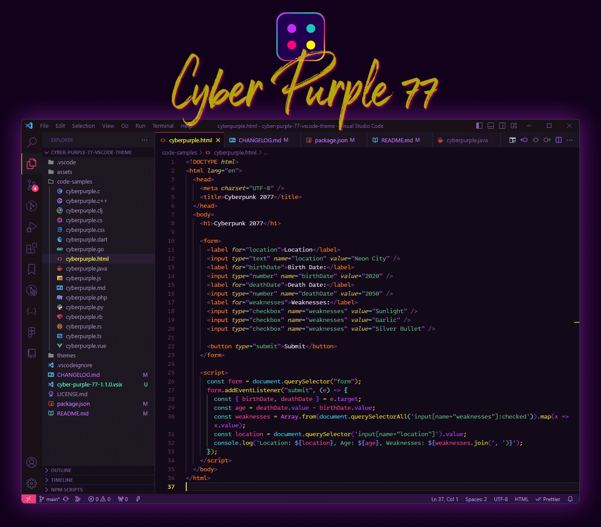
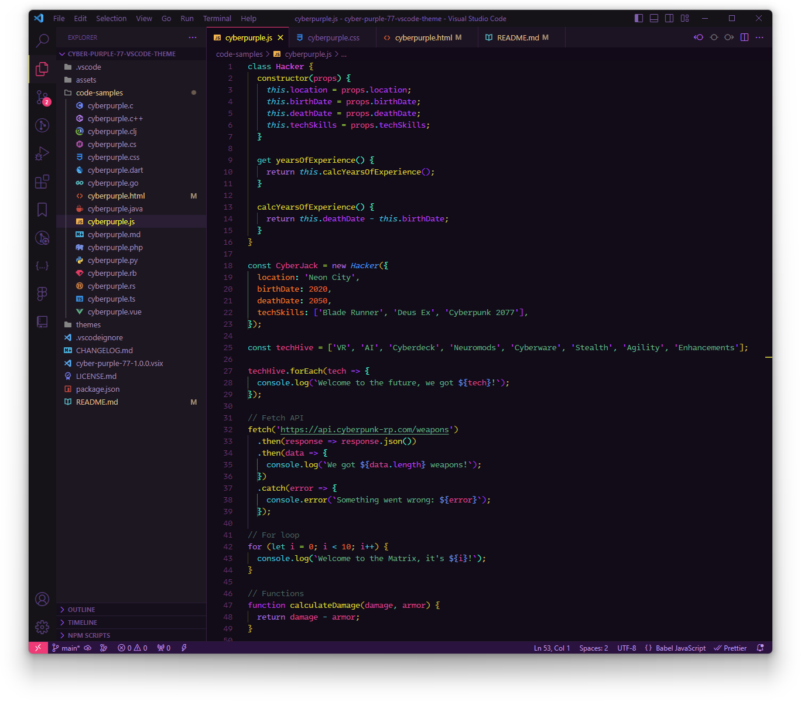
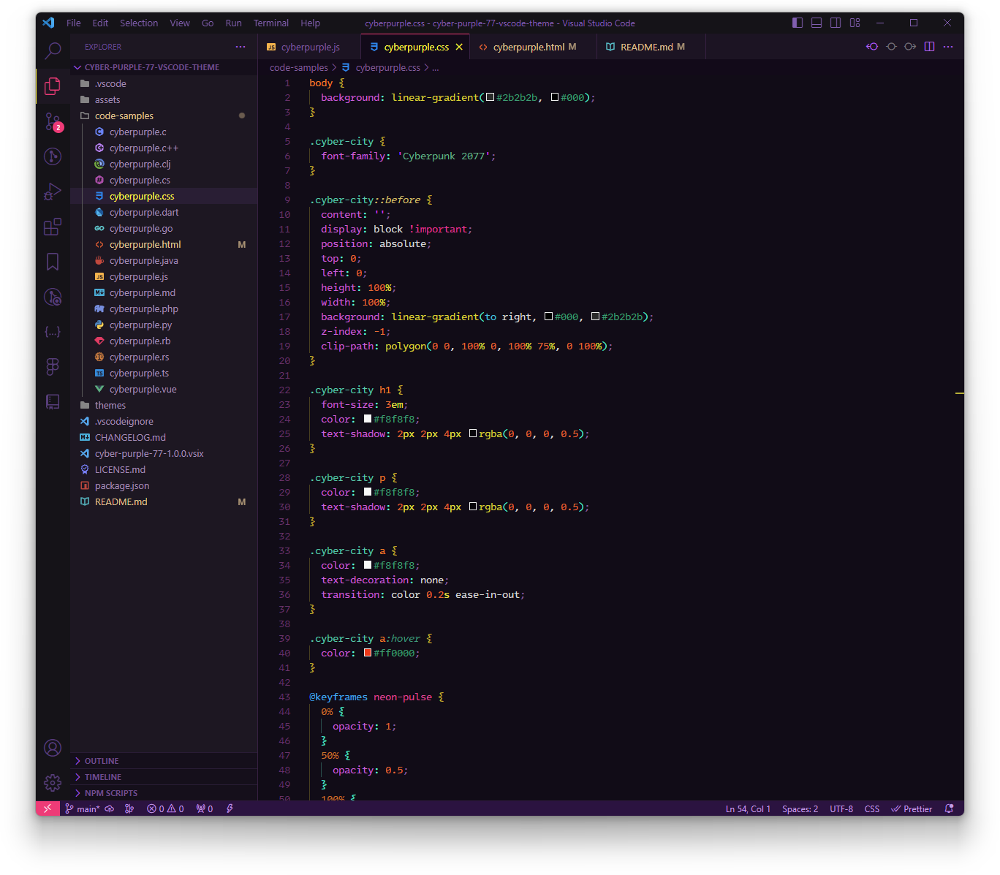

Theme slightly inspired on Cyberpunk 2077 colors, but with more purple.  
This is my first theme, so nothing super special.  

:bulb: Highly recommended to have a proper calibrated display. This was optimized on a good IPS display, with and without HDR.

## VS Code Settings Recommendations
**Editor Settings:**
- Font Family: [Intel One Mono](https://www.intel.com/content/www/us/en/company-overview/one-monospace-font.html)
- `"editor.letterSpacing": -0.3,`
- `"editor.fontSize": 13.5,`
- `"editor.lineHeight": 20,`

**Terminal Settings:**
- Font Family: [EnvyCodeR Nerd Font Mono](https://www.nerdfonts.com/font-downloads)
- `"terminal.integrated.fontSize": 14,`
- `"terminal.integrated.cursorStyle": "underline",`
- `"terminal.integrated.cursorBlinking": true,`
- `"terminal.integrated.cursorStyleInactive": "underline",`

**Other settings**
- The theme has `"semanticHighlighting": false` by default. If you have it enabled on your settings, it will work fine but some elements will be different due to how the tokens/scopes change when semantic is enabled. You can of course customize your own tokens via `"editor.tokenColorCustomizations"`.
- `"editor.bracketPairColorization.enabled": true,` is highly recommended so it applies the theme colors properly (I defined up to 4 levels of brackets). The 2 settings below goes well together with this also:
- `"editor.guides.bracketPairs": true,`
- `"editor.matchBrackets": "never",`

Personal preference:
- VS Code Icons: [Bearded Icons](https://marketplace.visualstudio.com/items?itemName=BeardedBear.beardedicons). Should be used with `"workbench.tree.indent": 20,`
- `"window.titleBarStyle": "custom",`
- `"editor.renderWhitespace": "trailing",`
- `"files.trimTrailingWhitespace": true,`

## Languages optimizations
This was carefully customized for:
- JavaScript
- TypeScript
- React (JSX / TSX)
- CSS and SCSS (they will look almost identical)
- HTML
- JSON
- Markdown

I tested some code samples from other languages, on the ***theme repository there is a "code-samples" folder*** that you can download to see how it looks for each language. It should still look OK for most of them, like `C#, Go, Java, PHP, Python and Vue` (provided you have Vue extension highlight installed of course).

For other languages, it still look ok most of the time, whatever isn't grabbed by the tokes will have a almost white purple foreground, easily customized via `editor.tokenColorCustomizations`'.

## More screenshots

### JavaScript

### CSS

---

If you like this theme, I appreciate if you [follow me on GitHub](https://github.com/fleps).

